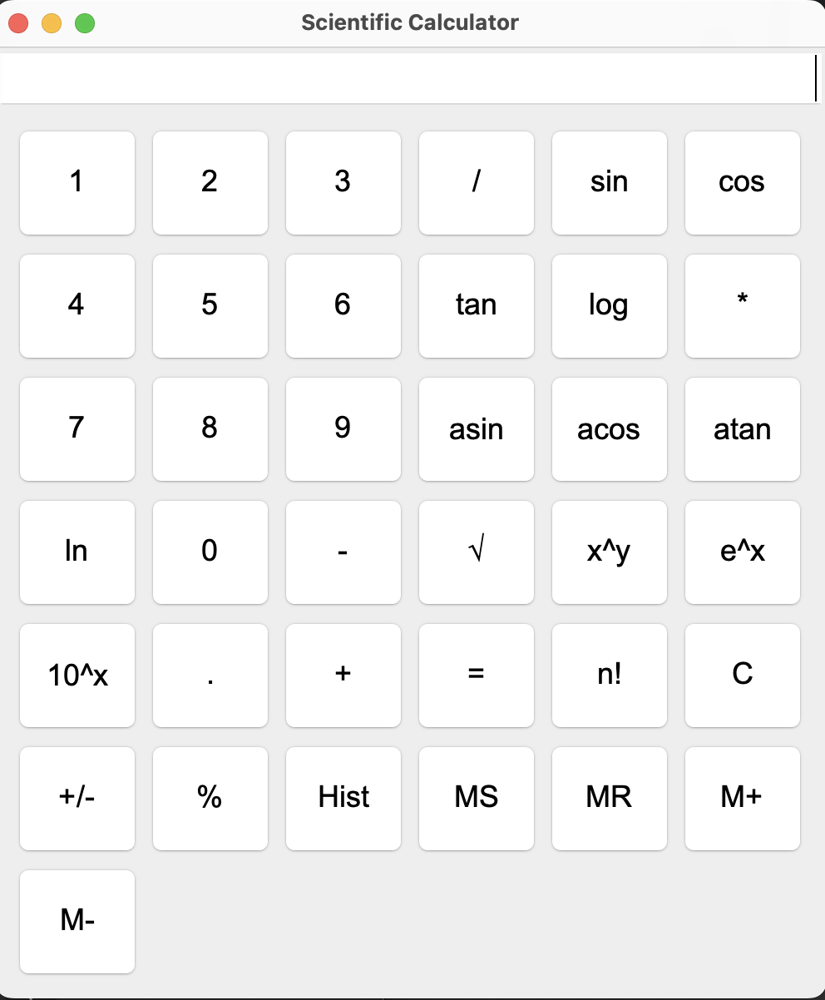

# Scientific Calculator – Java Swing

## Overview

This is a desktop **scientific calculator application** developed using **Java Swing**.  
It supports both basic arithmetic and advanced mathematical operations such as trigonometry, logarithmic, and exponential functions — all implemented using **modular OOP principles**, GUI components, and Java's built-in `Math` library.

---

## Features

- Arithmetic: +, −, ×, ÷, %, √, x²
- Trigonometry: sin, cos, tan, asin, acos, atan (deg & rad)
- Exponential: eˣ, 10ˣ, xʸ
- Logarithmic: log, ln
- Special: Factorial (n!), memory operations (M+, MR, MC)
- Input validation & exception handling
- Clean modular structure with:  
  ➤ **Abstraction**  
  ➤ **Encapsulation**  
  ➤ **Inheritance**  
  ➤ **Polymorphism**

---

## GUI Preview

> Built using `JFrame`, `JPanel`, `JButton`, `JTextField`, etc.  
> Layout managers used: `BorderLayout`, `GridLayout`  
> Fully keyboard-operable + mouse click support

---

## How to Run

1. Open project in **Eclipse** or **IntelliJ**
2. Navigate to `src/` folder
3. Compile and run `Main.java`
4. Use keyboard or mouse to interact with the calculator GUI

---

## Author

**Mehlika Rana Akbay**  
BSc. Software Engineering – UE Germany  

